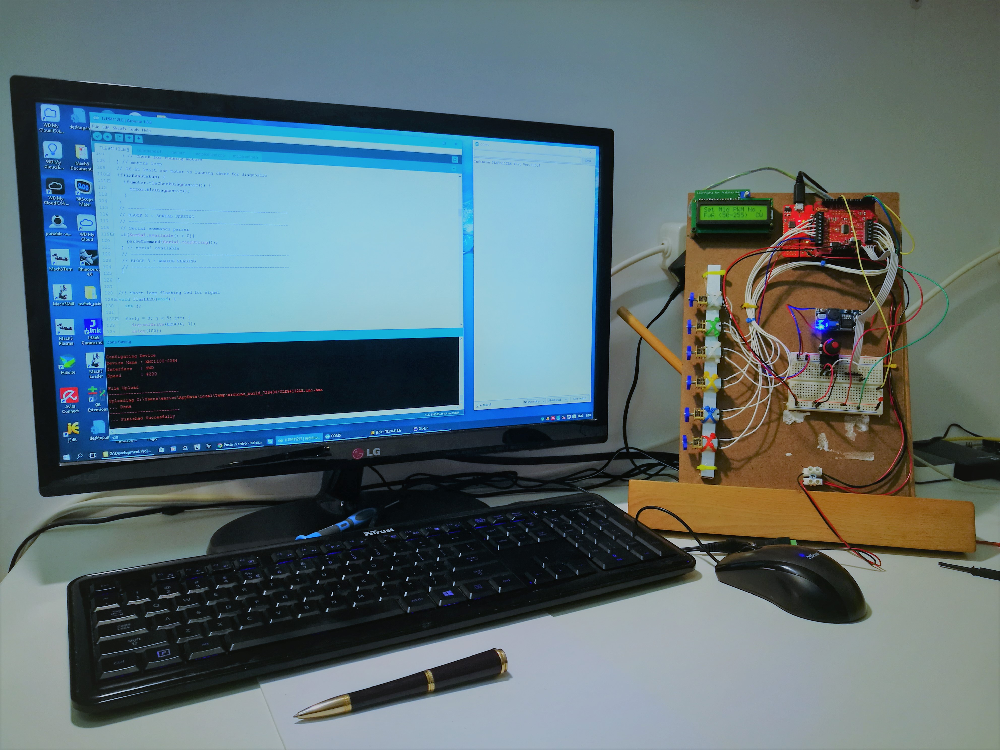
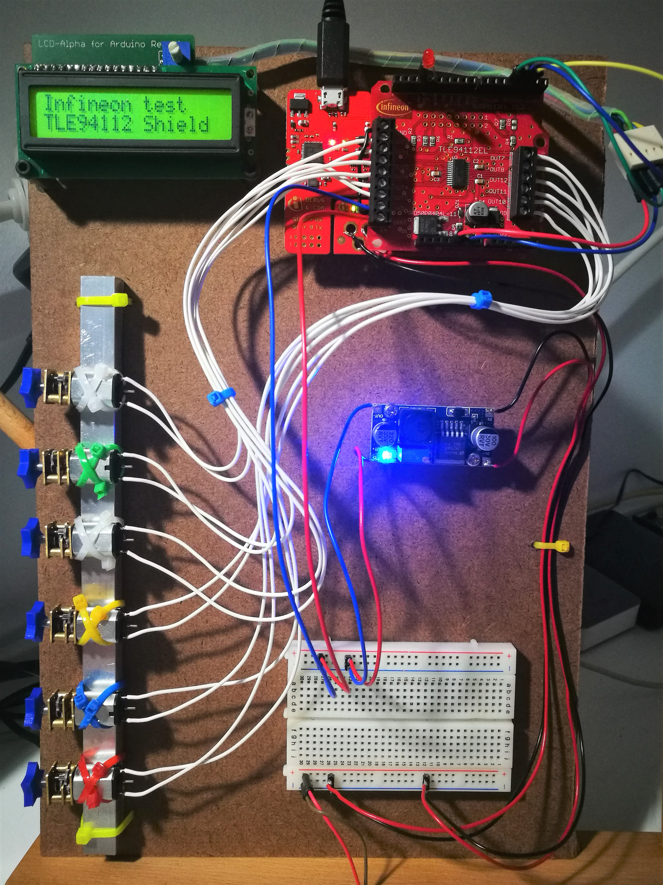
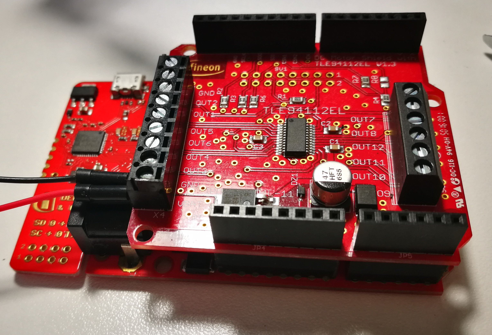

# Infineon TLE94112LE Test
## Interactive test platform for the infineon TLE94112LE Shield for Arduino

## Design note
This if the software application created with the Arduino IDE 1.8.3 to run the
test platform.

This application is specific for the hardware building but can be easily modified
to run with different kind of brushed motors and other inductive components.

The test platform has been created to manage interactively most (almost all) of
the features and functions of the motor controller shield. This version
uses 6 brushed geared micro motors running at 6V max (power is set to 5.5V).

Warning: using and higher power for motors a the LCD backlight should be powered
bt the Arduino 5V to avoid damage.

### Functional components
The platform has a LCD display to interactively show the motor settings. Every
single motor can be set separately or all together. The TLE94112LE shield motors
are powered by a 5.5V regulated DC-DC small board while a potentiometer connected
to the Arduino channel A0 is used to dynamically modify the PWM duty cycle.

Please note that the duty cycle configuration is related to the PWM even also the
software permit setting different duty cycle values for every single motor it is
not working due the limitation of the board. The duty cycle setting should be
used selecting all the motors together. This issue will be updated in future
versions.

### MCU

This software is compatible with Arduino UNO R3, Genuino 101 and Arduino 101 but
the best performances are reached with the Infineon XMC1100 Boot kit Arduino 
compatible board.

## Commands
Excluding the potentiometer on the board all the controls are sent via terminal 
through a USB-to-serial connection. The available commands are listed below:

### Direction control
- __cw__ : clockwise rotation
- __ccw__ : counterclockwise rotation
- __accel__ : Enable the acceleration when motor start
- __noaccel__ : Disable the acceleration when motor start

### Global action commands
- __start__ : start all motors
- __stop__ : stop all motors
- __reset__ : reset the system to the default

### Single motor action commands
- __m1on__ : start motor 1
- __m2on__ : start motor 2
- __m3on__ : start motor 3
- __m4on__ : start motor 4
- __m5on__ : start motor 5
- __m6on__ : start motor 6
- __m1off__ : stop motor 1 
- __m2off__ : stop motor 2
- __m3off__ : stop motor 3
- __m4off__ : stop motor 4 
- __m5off__ : stop motor 5
- __m6off__ : stop motor 6

### Duty cycle settings to PWM channels
- __dcmanual__ : Set the duty cycle value depending on the pot
- __dcauto__ : Set the duty cycle current limits
- __dcmin__ : Set the min duty cycle value via pot
- __dcmax__ : Set the max duty cycle value via pot

### PWM channel selection for duty cycle settings
- __dc80__ : Set the duty cycle to the PWM channel 80Hz
- __dc100__ : Set the duty cycle to the PWM channel 100Hz
- __dc200__ : Set the duty cycle to the PWM channel 200Hz
- __dcPWM__ : Set the duty cycle to all the PWM channels

### Motor select for settings
- __all__ : Select and enable all motors
- __none__ : Disble all motors and deselect
- __m1__ : select motor 1
- __m2__ : select motor 2
- __m3__ : select motor 3
- __m4__ : select motor 4
- __m5__ : select motor 5
- __m6__ : select motor 6

### Motor enable
- __m1+__ : enable motor 1
- __m2+__ : enable motor 2
- __m3+__ : enable motor 3
- __m4+__ : enable motor 4
- __m5+__ : enable motor 5
- __m6+__ : enable motor 6

### PWM Frequency selector (assign PWM channels to motors)
- __noPWM__ : No PWM
- __80__ : PWM 80 Hz
- __100__ : PWM 100 Hz
- __200__ : PWM 200 Hz

### Freewheeling mode motor(s) setting
- __fwactive__ : Fereewheeling active
- __fwpassive__ : Freewheeling passive

### Show all motorws configuration
- __conf__ : Dump the current settings

### Configuration dump
Below the defaault settings tables shown on the terminal after a _conf_ command
call.

### Motors settings

Motor|Enabled|Accel|Active FW|Dir|PWM
|-----|-------|-----|---------|---|---|
| M1  |   No  |  No |   Yes   | CW| No|
| M2  |   No  |  No |   Yes   | CW| No|
| M3  |   No  |  No |   Yes   | CW| No|
| M4  |   No  |  No |   Yes   | CW| No|
| M5  |   No  |  No |   Yes   | CW| No|
| M6  |   No  |  No |   Yes   | CW| No|

### PWM settings

PWM Chan|DC Min|DC Max|DC Man
|--------+|------|------|------|
|  80 Hz |  50  | 255  |   No |
| 100 Hz |  50  | 255  |   No |
| 200 Hz |  50  | 255  |   No |

